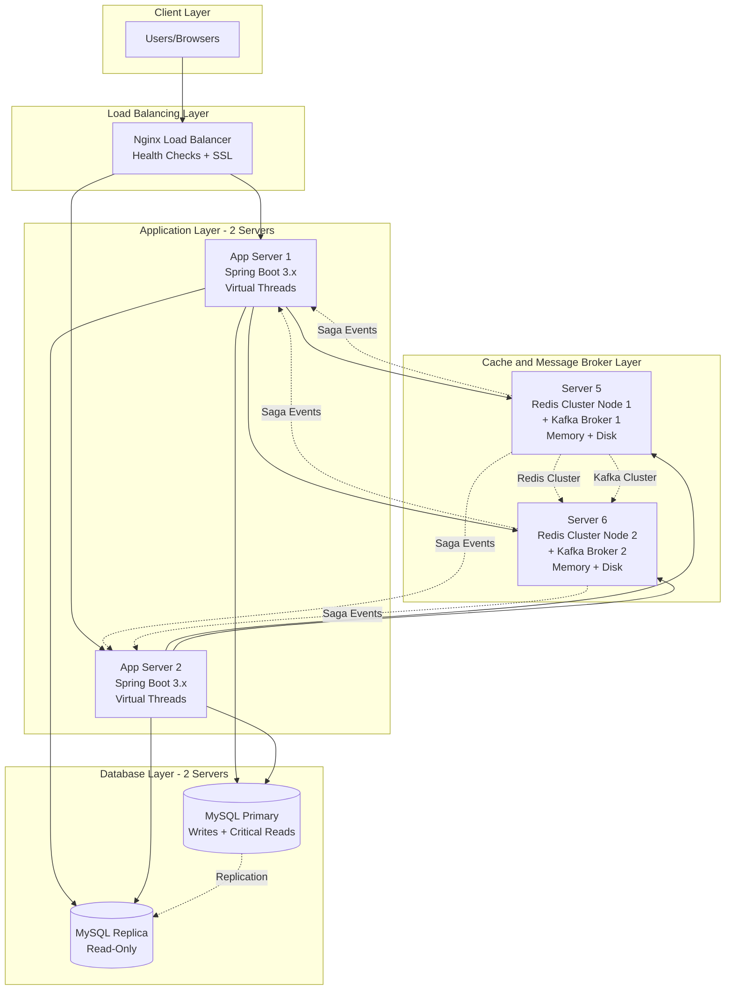
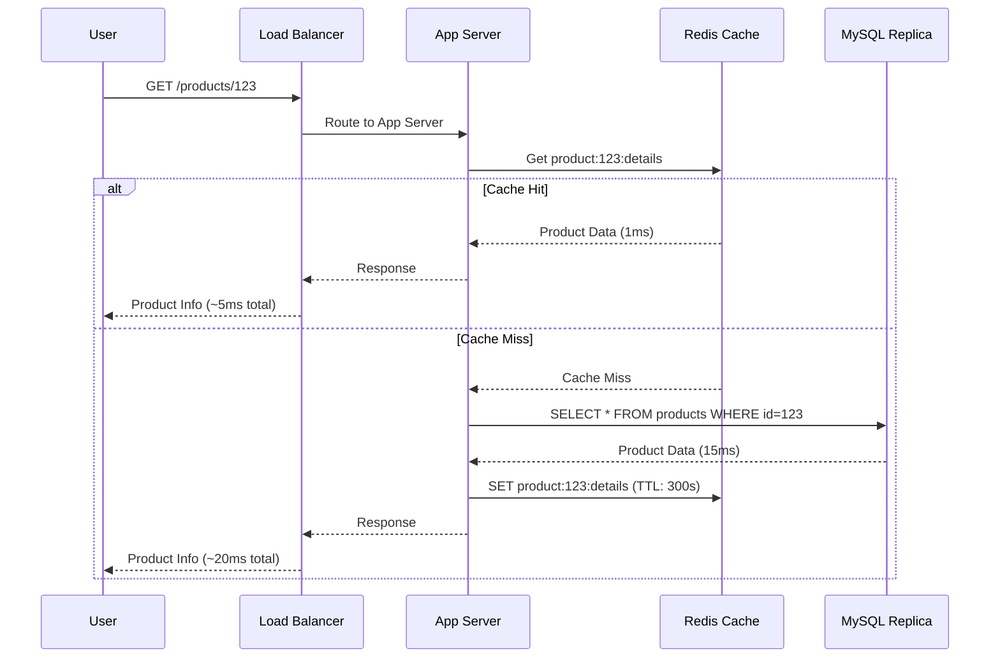
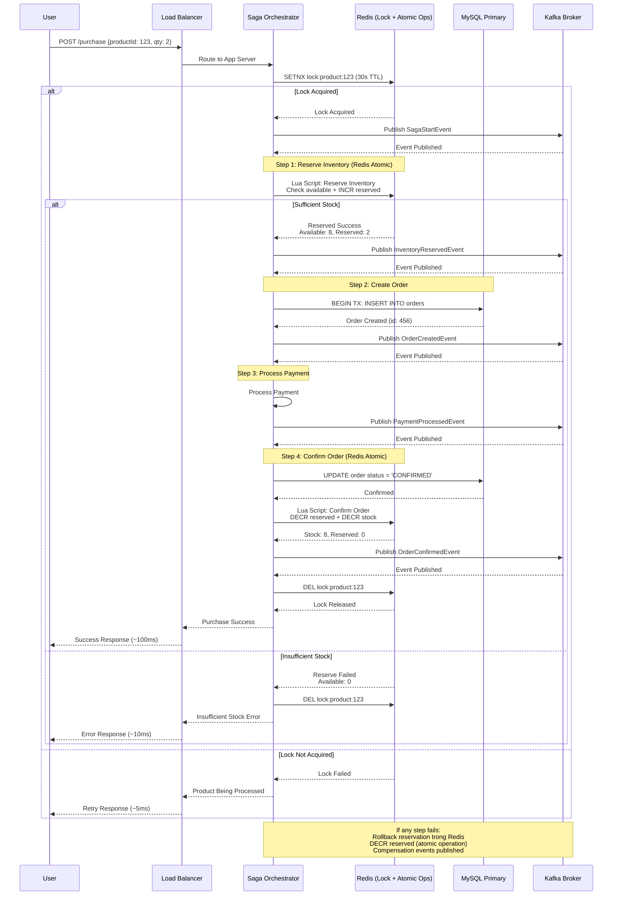
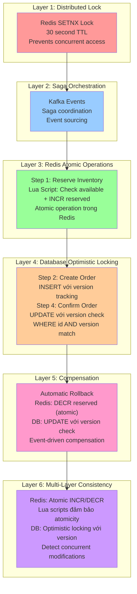
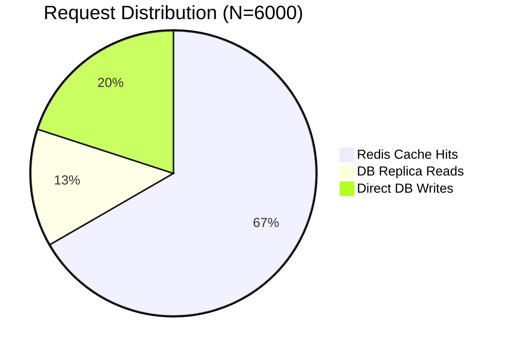
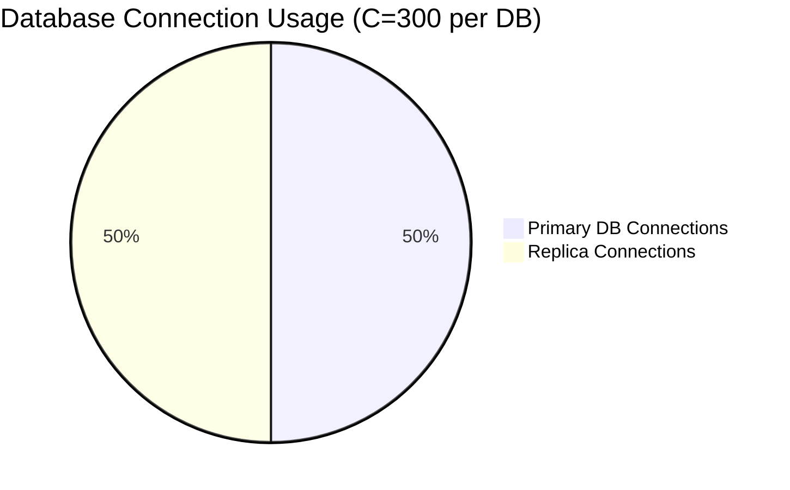
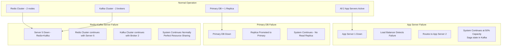
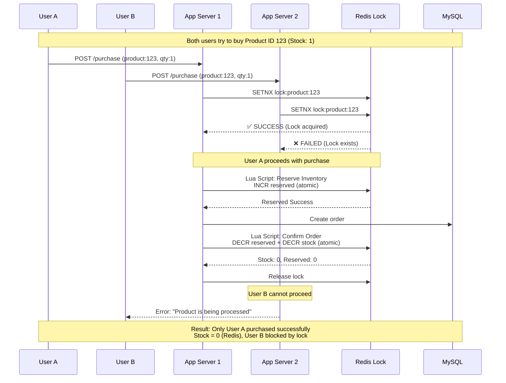
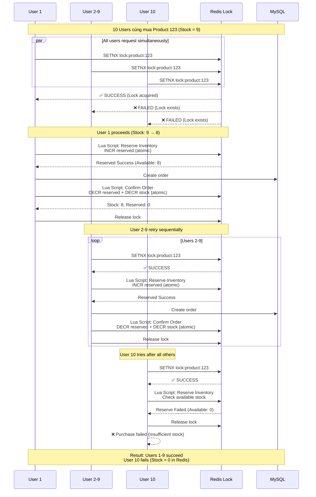
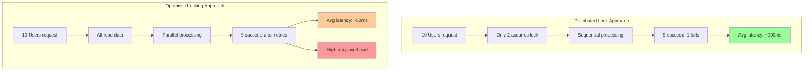

# Architecture Diagrams

## System Architecture Overview

## Request Flow - Product Viewing

## Request Flow - Product Purchase (Saga Pattern với Redis Atomic Operations)

## Data Consistency Mechanism (Saga Pattern với Redis Atomic + DB Optimistic Locking)

## Capacity Distribution

## High Availability - Failover Scenarios

## Redis Distributed Lock - Concurrent Purchase Prevention

## Concurrent Purchase: 10 Users, Stock = 9

## Distributed Lock vs Optimistic Locking Comparison

