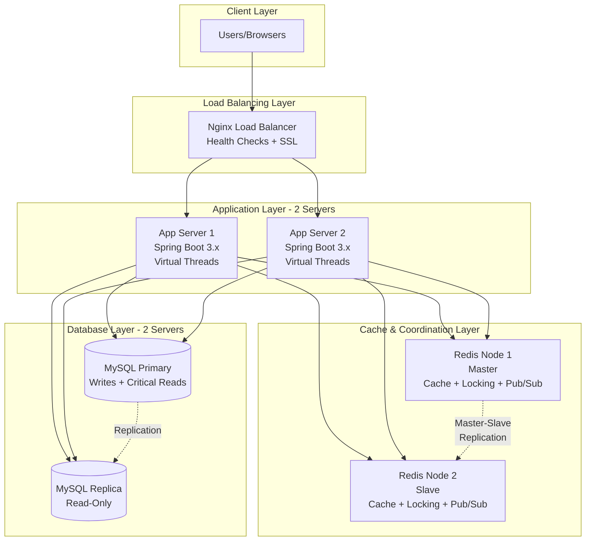
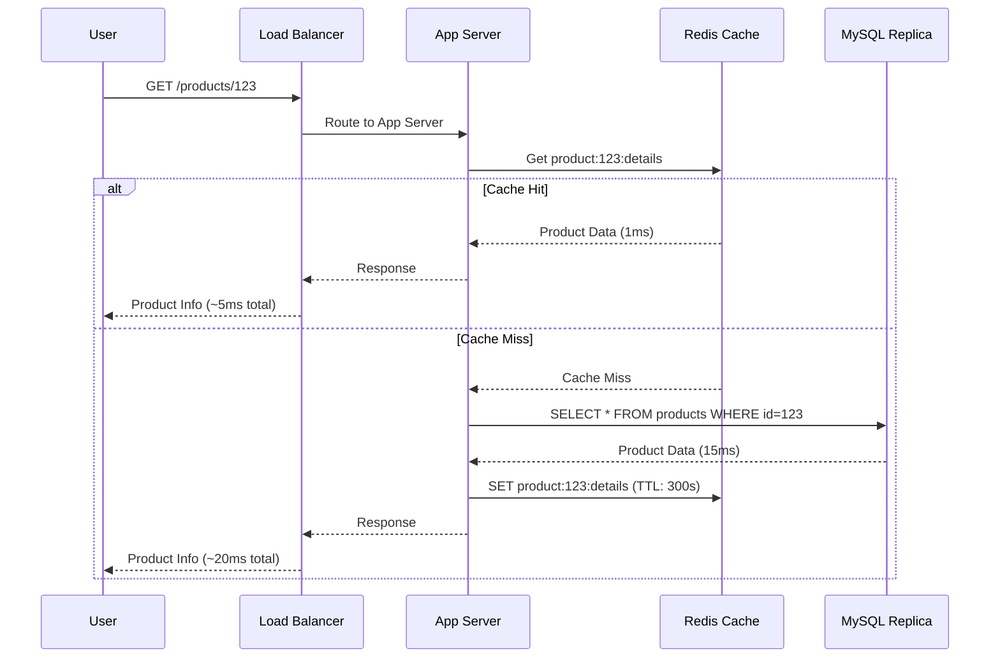
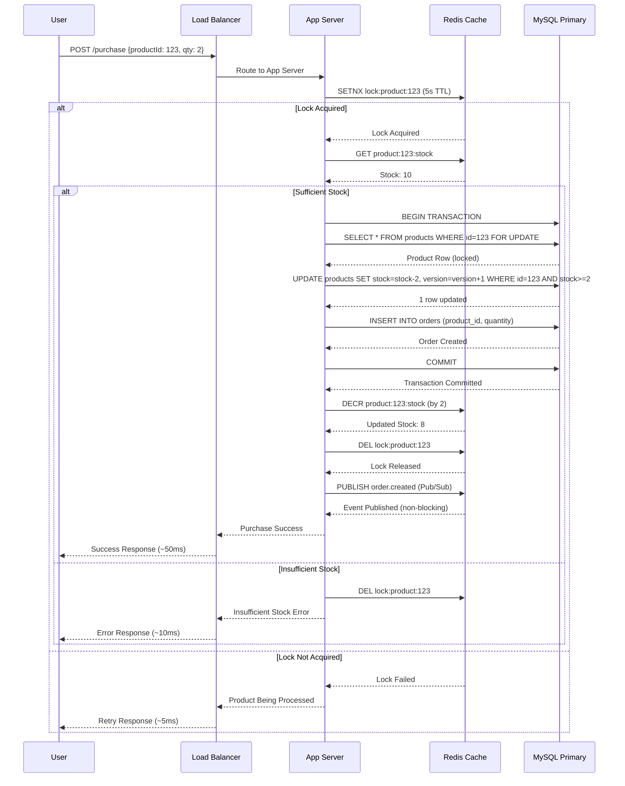
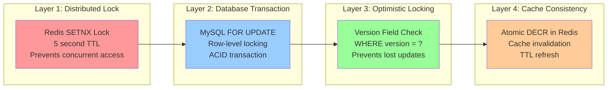
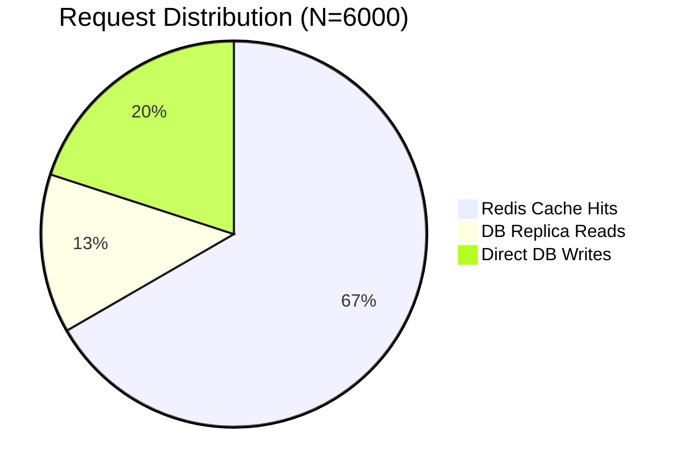
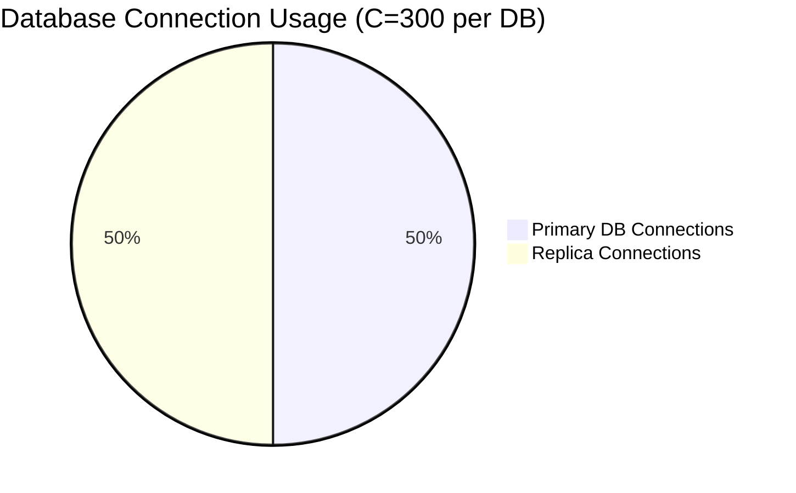

# Architecture Diagrams

## System Architecture Overview



## Request Flow - Product Viewing



## Request Flow - Product Purchase



## Data Consistency Mechanism



## Capacity Distribution





## High Availability - Failover Scenarios

```mermaid
graph TB
    subgraph "Normal Operation"
        N1[All 2 App Servers Active]
        N2[Primary DB + 1 Replica]
        N3[Redis Master-Slave (2 Nodes)]
    end
    
    subgraph "App Server Failure"
        A1[App Server 1 Down]
        A2[Load Balancer Detects Failure]
        A3[Routes to App Server 2]
        A4[System Continues at 50% Capacity]
    end
    
    subgraph "Primary DB Failure"
        D1[Primary DB Down]
        D2[Replica Promoted to Primary]
        D3[System Continues (No Read Replica)]
    end
    
    subgraph "Redis Master Failure"
        R1[Redis Master Down]
        R2[Slave Promoted to Master]
        R3[Data Replicated from Previous Master]
        R4[System Continues with Single Redis Node]
    end
    
    N1 --> A1
    N2 --> D1
    N3 --> R1
```

