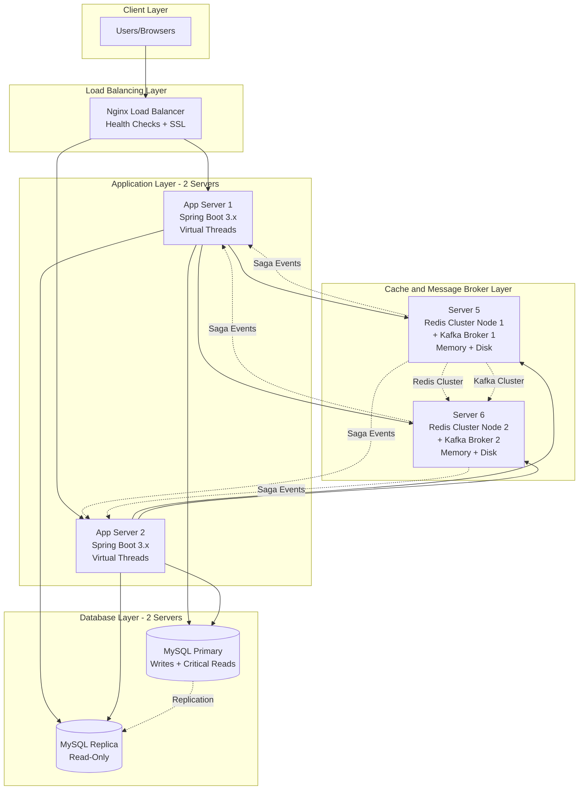
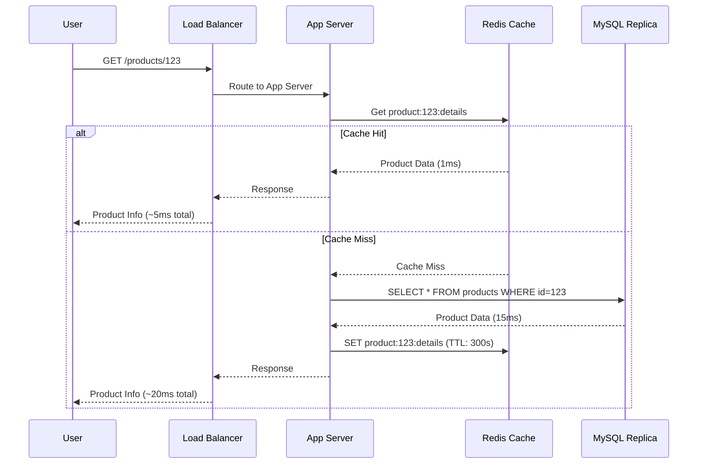
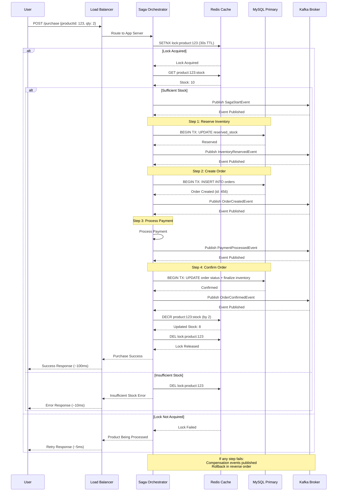
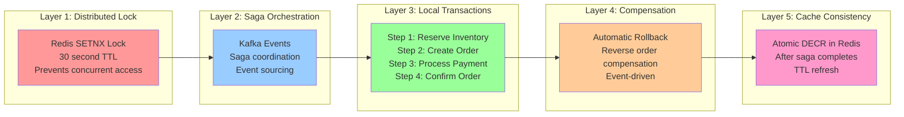
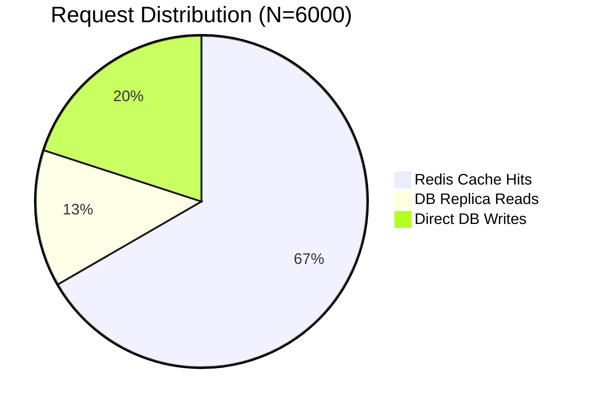
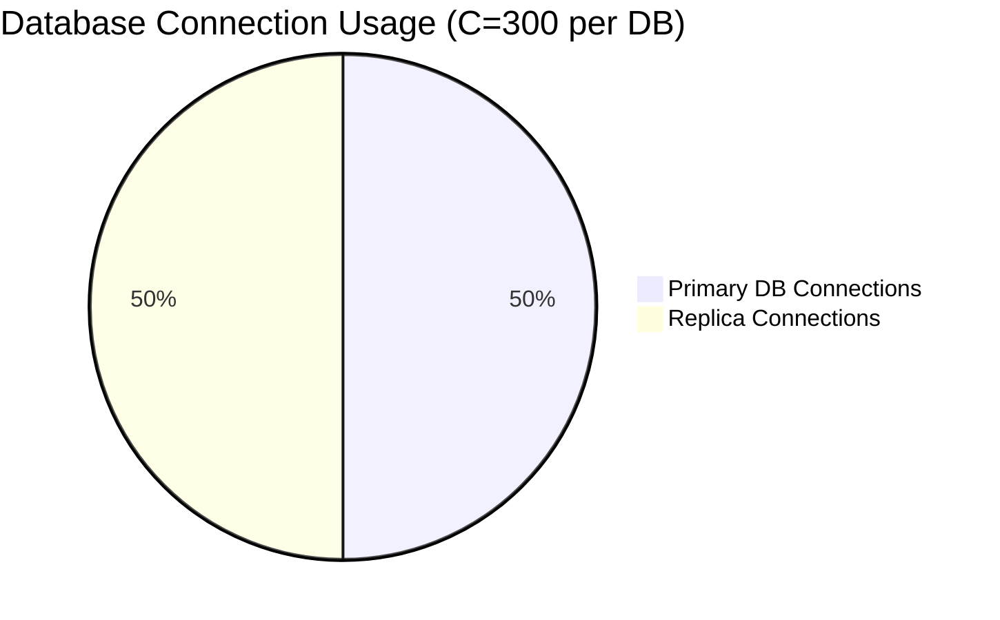
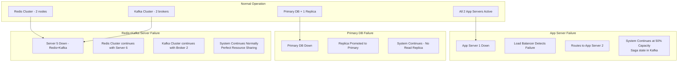

# Architecture Diagrams

## System Architecture Overview

## Request Flow - Product Viewing

## Request Flow - Product Purchase (Saga Pattern)

## Data Consistency Mechanism (Saga Pattern)

## Capacity Distribution

## High Availability - Failover Scenarios

